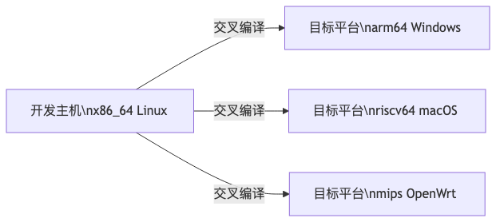
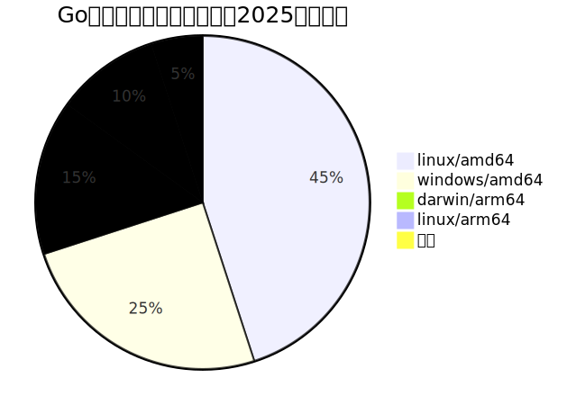
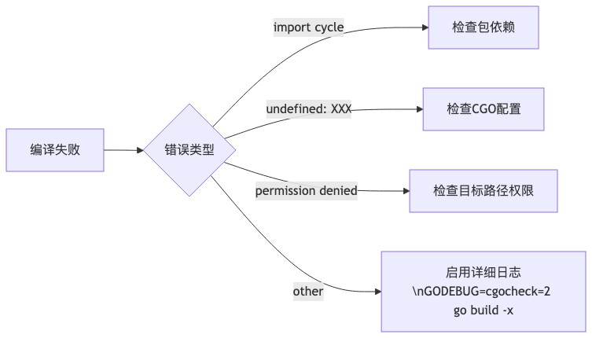

<!--more-->
> 本文由 [简悦 SimpRead](http://ksria.com/simpread/) 转码， 原文地址 [blog.csdn.net](https://blog.csdn.net/gitblog_00445/article/details/151852088)

Go 语言交叉编译：多平台构建
---------------

### 引言

你是否还在为 Go 项目的多平台部署而烦恼？从开发环境到生产服务器，从 PC 到嵌入式设备，手动配置不同架构的编译环境既耗时又容易出错。本文将系统讲解 Go 语言交叉编译（Cross-Compilation）的全流程，帮助你一文掌握从环境配置到自动化构建的完整解决方案，轻松实现 "一次编码，到处运行"。

读完本文你将获得：

*   交叉编译的核心原理与 Go 语言的实现优势
*   主流操作系统与架构的编译参数配置
*   静态链接、CGO 支持等高级场景解决方案
*   自动化构建脚本与 CI/CD 集成最佳实践
*   常见问题诊断与性能优化技巧

### 交叉编译基础

#### 什么是交叉编译

交叉编译（Cross-Compilation）是指在一种计算机架构（主机）上生成另一种架构（目标机）可执行代码的过程。与本地编译相比，其核心优势在于：



Go 语言自 1.5 版本起原生支持交叉编译，无需复杂的交叉编译器配置，这得益于其独特的设计：

*   统一的中间代码（IR）设计
*   内置的跨平台标准库
*   静态链接优先的编译策略

#### 环境准备

**基础环境要求**

*   Go 1.11+（推荐 1.16 + 以支持模块代理和`GOOS`/`GOARCH`自动检测）
*   Git（用于获取源码和依赖）
*   构建工具链（GCC 或 Clang，仅 CGO 场景需要）

**安装 Go 编译器**

```
# 下载并安装Go（以Linux为例）
wget https://dl.google.com/go/go1.21.0.linux-amd64.tar.gz
sudo tar -C /usr/local -xzf go1.21.0.linux-amd64.tar.gz
echo 'export PATH=$PATH:/usr/local/go/bin' >> ~/.bashrc
source ~/.bashrc
 
# 验证安装
go version  # 应输出 go version go1.21.0 linux/amd64
```

### 核心编译参数

Go 通过环境变量控制编译行为，核心参数如下：

<table><thead><tr><th>环境变量</th><th>作用</th><th>常用值</th></tr></thead><tbody><tr><td><code onclick="mdcp.copyCode(event)">GOOS</code></td><td>目标操作系统</td><td>linux, windows, darwin, freebsd, android, ios</td></tr><tr><td><code onclick="mdcp.copyCode(event)">GOARCH</code></td><td>目标架构</td><td>amd64, arm64, 386, arm, riscv64, mips64</td></tr><tr><td><code onclick="mdcp.copyCode(event)">GOARM</code></td><td>ARM 架构版本</td><td>5, 6, 7, 8（仅 ARM 架构有效）</td></tr><tr><td><code onclick="mdcp.copyCode(event)">GOMIPS</code></td><td>MIPS 架构浮点模式</td><td>hardfloat, softfloat（仅 MIPS 架构有效）</td></tr><tr><td><code onclick="mdcp.copyCode(event)">CGO_ENABLED</code></td><td>CGO 支持开关</td><td>0（禁用）, 1（启用）</td></tr><tr><td><code onclick="mdcp.copyCode(event)">GOFLAGS</code></td><td>额外编译参数</td><td>-ldflags="-s -w"（减小二进制体积）</td></tr></tbody></table>

**参数优先级**：命令行参数 > 环境变量 > `go.env`配置 > 默认值



### 实战：主流平台编译示例

#### 基础编译命令

通用语法：

```
GOOS=<目标OS> GOARCH=<目标架构> [其他参数] go build [编译选项] -o <输出文件>


```

#### 桌面平台

**Linux (x86_64)**

```
GOOS=linux GOARCH=amd64 go build -ldflags="-s -w" -o app-linux-amd64


```

**Windows (x86_64)**

```
GOOS=windows GOARCH=amd64 go build -o app-windows-amd64.exe


```

**macOS (Apple Silicon)**

```
GOOS=darwin GOARCH=arm64 go build -o app-darwin-arm64


```

**macOS (Intel)**

```
GOOS=darwin GOARCH=amd64 go build -o app-darwin-amd64


```

#### 服务器与云平台

**Linux ARM64 (AWS Graviton)**

```
GOOS=linux GOARCH=arm64 go build -o app-linux-arm64


```

**Linux RISC-V (开源硬件)**

```
GOOS=linux GOARCH=riscv64 go build -o app-linux-riscv64


```

**FreeBSD (服务器)**

```
GOOS=freebsd GOARCH=amd64 go build -o app-freebsd-amd64


```

#### 嵌入式与移动平台

**Android (ARM64)**

```
GOOS=android GOARCH=arm64 go build -o app-android-arm64


```

**iOS (ARM64)**

```
GOOS=ios GOARCH=arm64 CGO_ENABLED=1 go build -o app-ios-arm64


```

**OpenWrt (MIPS)**

```
GOOS=linux GOARCH=mips GOMIPS=softfloat go build -o app-openwrt-mips


```

### 高级配置

#### 静态链接优化

Go 默认采用静态链接，但部分标准库函数（如`net`包的 DNS 解析）在某些平台依赖系统库。完全静态链接需特殊处理：

```
# Linux完全静态链接（无libc依赖）
GOOS=linux GOARCH=amd64 CGO_ENABLED=0 go build -ldflags "-linkmode external -extldflags -static" -o app-linux-static
```

#### CGO 支持

当项目包含 CGO 代码时，需配置对应平台的 C 交叉编译器：

```
# 为ARM64 Linux编译带CGO的程序
CC=aarch64-linux-gnu-gcc GOOS=linux GOARCH=arm64 CGO_ENABLED=1 go build -o app-cgo-arm64
```

常见平台的 C 编译器配置：

<table><thead><tr><th>目标平台</th><th>编译器前缀</th><th>安装示例（Debian/Ubuntu）</th></tr></thead><tbody><tr><td>arm-linux</td><td>arm-linux-gnueabihf-gcc</td><td><code onclick="mdcp.copyCode(event)">sudo apt install gcc-arm-linux-gnueabihf</code></td></tr><tr><td>aarch64-linux</td><td>aarch64-linux-gnu-gcc</td><td><code onclick="mdcp.copyCode(event)">sudo apt install gcc-aarch64-linux-gnu</code></td></tr><tr><td>mips-linux</td><td>mips-linux-gnu-gcc</td><td><code onclick="mdcp.copyCode(event)">sudo apt install gcc-mips-linux-gnu</code></td></tr></tbody></table>

#### 环境变量持久化

创建`go.env`文件保存常用配置（Go 1.13 + 支持）：

```
# go.env
GO111MODULE=on
GOPROXY=https://goproxy.cn,direct
GOOS=linux
GOARCH=amd64


```

使用时通过`go env -w`命令写入：

```
go env -w GOOS=linux
go env -w GOARCH=amd64
```

### 自动化构建

#### 多平台构建脚本

创建`build-all.sh`实现一键编译：

```
#!/bin/bash
set -e
 
# 清理旧构建
rm -f app-*
 
# 定义目标平台列表
PLATFORMS=(
    "linux/amd64"
    "linux/arm64"
    "windows/amd64.exe"
    "darwin/amd64"
    "darwin/arm64"
    "linux/riscv64"
)
 
# 编译参数
LDFLAGS="-s -w"
 
for PLATFORM in "${PLATFORMS[@]}"; do
    # 拆分OS和架构
    IFS=/ read -r GOOS GOARCH_EXT <<< "$PLATFORM"
    GOARCH=${GOARCH_EXT%.*}  # 移除文件扩展名
    EXT="${GOARCH_EXT#$GOARCH}"  # 获取文件扩展名
 
    OUTPUT="app-${GOOS}-${GOARCH}${EXT}"
    echo "Building ${OUTPUT}..."
    
    # 执行编译
    GOOS=$GOOS GOARCH=$GOARCH go build -ldflags="$LDFLAGS" -o "$OUTPUT"
done
 
echo "Build complete:"
ls -lh app-*
```

添加执行权限并运行：

```
chmod +x build-all.sh
./build-all.sh
```

#### CI/CD 集成（GitHub Actions）

创建`.github/workflows/cross-build.yml`：

```
name: Cross Build

on:
  push:
    tags:
      - 'v*'

jobs:
  build:
    runs-on: ubuntu-latest
    strategy:
      matrix:
        include:
          - os: linux
            arch: amd64
            ext: ""
          - os: windows
            arch: amd64
            ext: .exe
          - os: darwin
            arch: amd64
            ext: ""
          - os: darwin
            arch: arm64
            ext: ""
          - os: linux
            arch: arm64
            ext: ""

    steps:
      - uses: actions/checkout@v4
      
      - name: Set up Go
        uses: actions/setup-go@v5
        with:
          go-version: '1.21'
          cache: true
          
      - name: Build
        env:
          GOOS: ${{ matrix.os }}
          GOARCH: ${{ matrix.arch }}
          CGO_ENABLED: 0
        run: |
          OUTPUT="app-${{ matrix.os }}-${{ matrix.arch }}${{ matrix.ext }}"
          go build -ldflags="-s -w" -o $OUTPUT
          
      - name: Upload artifact
        uses: actions/upload-artifact@v3
        with:
          name: app-${{ matrix.os }}-${{ matrix.arch }}
          path: app-${{ matrix.os }}-${{ matrix.arch }}${{ matrix.ext }}


```

### 常见问题诊断

#### 编译错误排查流程



#### 常见问题解决方案

**1. 标准库编译错误**

```
undefined: syscall.Kevent


```

解决：确认目标平台是否支持该系统调用，或使用跨平台库如`golang.org/x/sys`

**2. CGO 依赖问题**

```
could not determine kind of name for C.foo


```

解决：检查 CGO_ENABLED 设置和 C 编译器配置，纯 Go 项目建议禁用 CGO

**3. 可执行文件无法运行**

```
exec format error


```

解决：确认目标平台与编译时的 GOOS/GOARCH 参数匹配

**4. 动态链接库缺失**

```
error while loading shared libraries: libc.so.6: cannot open shared object file


```

解决：禁用 CGO 或使用静态链接

### 性能优化

#### 二进制体积减小

<table><thead><tr><th>优化方法</th><th>效果</th><th>命令示例</th></tr></thead><tbody><tr><td>移除调试信息</td><td>~30%</td><td><code onclick="mdcp.copyCode(event)">-ldflags="-s -w"</code></td></tr><tr><td>启用压缩</td><td>~15-20%</td><td><code onclick="mdcp.copyCode(event)">GOCOMPRESS=gz go build</code>（Go 1.21+）</td></tr><tr><td>功能裁剪</td><td>取决于使用情况</td><td><code onclick="mdcp.copyCode(event)">-tags=netgo,osusergo</code></td></tr></tbody></table>

#### 构建速度提升

1.  **启用编译缓存**

```
go env -w GOCACHE=$HOME/.cache/go-build


```

2.  **并行编译**

```
go build -p 4  # 使用4个并行编译进程


```

3.  **增量构建**

```
go build -i  # 安装依赖到GOPATH，加速后续构建


```

### 总结与展望

Go 语言的交叉编译能力极大简化了多平台开发流程，从个人项目到企业级应用都能从中受益。随着 Go 1.21 + 对 WebAssembly、iOS/macOS 交叉编译的改进，以及`GOARCH=wasip1`等新架构的支持，Go 在跨平台领域的优势将进一步扩大。

建议开发者：

1.  始终使用最新稳定版 Go 以获取最佳支持
2.  为不同平台创建专用的构建配置文件
3.  将交叉编译集成到 CI/CD 流程中实现自动化
4.  关注 Go 官方博客了解编译工具链更新

通过本文介绍的方法，你可以轻松构建覆盖 PC、服务器、移动设备和嵌入式系统的 Go 应用。立即尝试使用文中的脚本和配置，体验 Go 语言 "一次编写，到处运行" 的强大能力！

### 附录：常用平台参数速查表

<table><thead><tr><th>目标平台</th><th>GOOS</th><th>GOARCH</th><th>额外参数</th></tr></thead><tbody><tr><td>Linux x86 32 位</td><td>linux</td><td>386</td><td></td></tr><tr><td>Linux x86 64 位</td><td>linux</td><td>amd64</td><td></td></tr><tr><td>Linux ARM 32 位 v7</td><td>linux</td><td>arm</td><td>GOARM=7</td></tr><tr><td>Linux ARM 64 位</td><td>linux</td><td>arm64</td><td></td></tr><tr><td>Windows x86 64 位</td><td>windows</td><td>amd64</td><td></td></tr><tr><td>Windows ARM 64 位</td><td>windows</td><td>arm64</td><td></td></tr><tr><td>macOS Intel</td><td>darwin</td><td>amd64</td><td></td></tr><tr><td>macOS Apple Silicon</td><td>darwin</td><td>arm64</td><td></td></tr><tr><td>FreeBSD x86 64 位</td><td>freebsd</td><td>amd64</td><td></td></tr><tr><td>OpenBSD x86 64 位</td><td>openbsd</td><td>amd64</td><td></td></tr><tr><td>Android ARM 64 位</td><td>android</td><td>arm64</td><td></td></tr><tr><td>iOS ARM 64 位</td><td>ios</td><td>arm64</td><td>CGO_ENABLED=1</td></tr><tr><td>WebAssembly</td><td>wasip1</td><td>wasm</td><td></td></tr><tr><td>RISC-V 64 位</td><td>linux</td><td>riscv64</td><td></td></tr><tr><td>MIPS 32 位</td><td>linux</td><td>mips</td><td>GOMIPS=softfloat</td></tr></tbody></table>