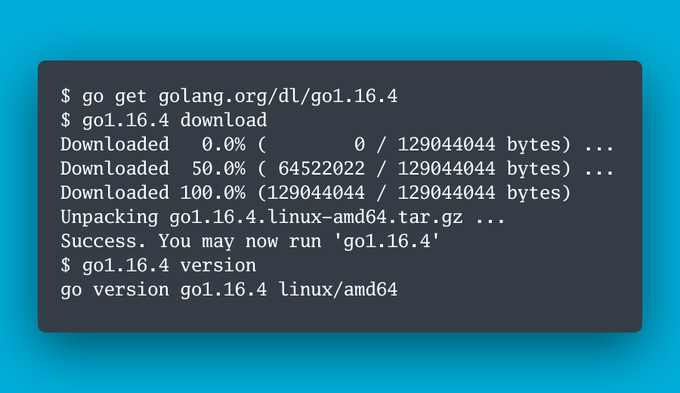

> 本文由 [简悦 SimpRead](http://ksria.com/simpread/) 转码， 原文地址 [blog.csdn.net](https://blog.csdn.net/weixin_44621343/article/details/133148154)

Go 多版本管理工具
----------------------------------------------------------------------------------------------------------------------------


在平时开发中，本地新旧项目并行开发的过程中，你大概率会遇到一个令人头疼的问题，如何同时使用两个不同版本的 Golang Runtime 进行开发呢？

### 一、go get 命令

**这种方法有一个前提，那就是当前系统中已经通过标准方法安装过某个版本的 Go 了。**

#### 1.1 使用方法：

在项目中初始化 Go Modules：

```
go mod init <module-name>

```

go 版本安装 / 版本切换, 安装不同版本的 Go：

```
go get golang.org/dl/go<x.y>
go<x.y> download
go<x.y> version

```



切换全局 Go 版本：

```
go<x.y> use

```

### 二、Goenv

官网：https://github.com/go-nv/goenv

Goenv 是另一个 Go 多版本管理工具，它的工作原理与其他语言的版本管理工具（如 [Ruby](https://so.csdn.net/so/search?q=Ruby&spm=1001.2101.3001.7020) 的 RVM 和 Python 的 pyenv）类似。以下是使用 Goenv 的基本步骤：

安装 Goenv（你需要先安装 Git）：

```
git clone https://github.com/syndbg/goenv.git ~/.goenv

```

将 Goenv 添加到你的 shell 配置文件（例如 `~/.bashrc` 或 `~/.zshrc`）中：

```
echo 'export GOENV_ROOT="$HOME/.goenv"' >> ~/.bashrc
echo 'export PATH="$GOENV_ROOT/bin:$PATH"' >> ~/.bashrc
echo 'eval "$(goenv init -)"' >> ~/.bashrc

```

安装你需要的 Go 版本：

```
goenv install go1.x.x

```

使用特定版本的 Go：

```
goenv global go1.x.x

```

### 三、GVM (Go Version Manager)

官网：https://github.com/moovweb/gvm

GVM 是一个流行的 Go 多版本管理工具，它允许你在同一台机器上安装和切换不同版本的 Go。以下是使用 GVM 的基本步骤：

安装 GVM：

```
bash < <(curl -s -S -L https://raw.githubusercontent.com/moovweb/gvm/master/binscripts/gvm-installer)

```

安装你需要的 Go 版本：

```
gvm install go1.x.x

```

使用特定版本的 Go：

```
gvm use go1.x.x

```

#### 指定安装目录
```bash
apt-get install bison acl bsdmainutils
bash -s master /opt < <(curl -s -S -L https://raw.githubusercontent.com/moovweb/gvm/master/binscripts/gvm-installer)
gvm install go1.23.2 -B
gvm use go1.23.2 --default
sudo setfacl -Rm d:u:${USER}:rwx /opt/go/
sudo setfacl -Rm u:${USER}:rwx /opt/go/
echo '[[ -s "/opt//gvm/scripts/gvm" ]] && source "/opt/gvm/scripts/gvm"' >> /etc/profile
echo 'export GOPATH=/opt/go' >> /etc/profile
```

### 四、voidint/g

#### 4.1 安装

`g`是一个 Linux、macOS、Windows 下的命令行工具，可以提供一个便捷的多版本 [go](https://golang.org/) 环境的管理和切换。 以下是使用 g 的基本步骤：

*   Linux/macOS（适用于 bash、zsh）
    
    ```
    # 建议安装前清空`GOROOT`、`GOBIN`等环境变量
    curl -sSL https://raw.githubusercontent.com/voidint/g/master/install.sh | bash
    echo "unalias g" >> ~/.bashrc # 可选。若其他程序（如'git'）使用了'g'作为别名。
    source "$HOME/.g/env"
    
    ```
    
*   Windows（适用于 pwsh）
    
    ```
    iwr https://raw.githubusercontent.com/voidint/g/master/install.ps1 -useb | iex
    
    ```
    

#### 4.2 冲突

这里如果你是 `oh-my-zsh` 的用户，那么你还需要做一件事，就是解决全局的 `g` 命令的冲突，解决的方式有两种，第一种是在你的 `.zshrc` 文件末尾添加 `unalias` ：

```
echo "unalias g" >> ~/.zshrc # 可选。若其他程序（如'git'）使用了'g'作为别名。
# 记得重启 shell ，或者重新 source 配置

```

第二种，则是调整 `~/.oh-my-zsh/plugins/git/git.plugin.zsh` 中关于 `g` 的注册，将其注释或删除掉：

```
# alias g='git'

```

我的 `.zshrc` 中的完整配置：

```
# 我的 g 的bin目录调整到了 .gvm ,所以你可能需要一些额外的调整
export PATH="${HOME}/.gvm/bin:$PATH"
export GOROOT="${HOME}/.g/go"
export PATH="${HOME}/.g/go/bin:$PATH"
export G_MIRROR=https://gomirrors.org/

```

#### 4.3 使用

查询当前可供安装的`stable`状态的 go 版本

```
$ g ls-remote stable
  1.19.10
  1.20.5

```

安装目标 go 版本`1.20.5`

```
$ g install 1.14.7
Downloading 100% [===============] (92/92 MB, 12 MB/s)               
Computing checksum with SHA256
Checksums matched
Now using go1.20.5

```

查询已安装的 go 版本

```
$ g ls
  1.19.10
* 1.20.5

```

查询可供安装的所有 go 版本

```
$ g ls-remote
  1
  1.2.2
  1.3
  1.3.1
  ...    // 省略若干版本
  1.19.10
  1.20rc1
  1.20rc2
  1.20rc3
  1.20
  1.20.1
  1.20.2
  1.20.3
  1.20.4
* 1.20.5

```

切换到另一个已安装的 go 版本

```
$ g use 1.19.10
go version go1.19.10 darwin/arm64

```

卸载一个已安装的 go 版本

```
$ g uninstall 1.19.10
Uninstalled go1.19.10

```

清空 go 安装包文件缓存

```
$ g clean 
Remove go1.18.10.darwin-arm64.tar.gz
Remove go1.19.10.darwin-arm64.tar.gz
Remove go1.20.5.darwin-arm64.tar.gz

```

查看 g 版本信息

```
g version 1.5.0
build: 2023-01-01T21:01:52+08:00
branch: master
commit: cec84a3f4f927adb05018731a6f60063fd2fa216

```

更新 g 软件本身

```
$ g self update
You are up to date! g v1.5.0 is the latest version.

```

卸载 g 软件本身

```
$ g self uninstall
Are you sure you want to uninstall g? (Y/n)
y
Remove /Users/voidint/.g/bin/g
Remove /Users/voidint/.g

```

总之，选择其中一个工具并根据你的需求进行设置。这些工具都可以有效地管理不同版本的 Go Runtime，使你能够轻松地在不同项目中切换和使用不同的 Go 版本。


## 参考文档

https://blog.csdn.net/weixin_44621343/article/details/133148154
