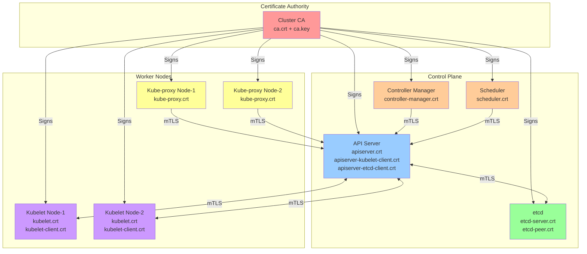
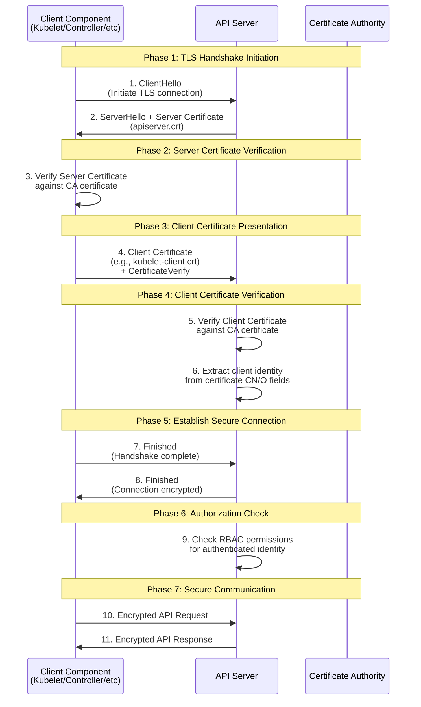

<!--more-->

## Part 1: Introduction (介绍)

**English:** Hello everyone. I will talk about how Kubernetes components use certificates to verify each other. 

**中文翻译：** 大家好。我将讲解Kubernetes组件如何使用证书来相互验证。

---

## Part 2: What is a Certificate? (什么是证书？)

**English:** A certificate is like a digital ID card. It proves "I am who I say I am." In Kubernetes, every component has its own certificate.

Think of it like this:

- Your passport proves your identity
- A certificate proves a component's identity

**中文翻译：** 证书就像一张数字身份证。它证明"我就是我所说的那个人"。在Kubernetes中，每个组件都有自己的证书。

可以这样理解：

- 您的护照证明您的身份
- 证书证明组件的身份

---

## Part 3: Main Parts (主要部分)

**English:** There are three main parts:

1. **CA (Certificate Authority)** - The trusted center that gives out certificates
2. **Certificate** - The digital ID card
3. **Private Key** - The secret password that proves you own the certificate

**中文翻译：** 有三个主要部分：

1. **CA（证书颁发机构）** - 发放证书的可信中心
2. **证书** - 数字身份证
3. **私钥** - 证明你拥有该证书的秘密密码

---

## Part 4: Kubernetes Components (K8S组件)

**English:** These components need certificates:

- **API Server** - The main control center
- **etcd** - The database that stores data
- **Kubelet** - The worker on each node
- **Controller Manager** - Manages the cluster
- **Scheduler** - Decides where to run applications

Each one gets a certificate from the CA. These are just the main services that show up. Aside from these, there are other services that also require certificates.

**中文翻译：** 这些组件需要证书：

- **API Server** - 主控制中心
- **etcd** - 存储数据的数据库
- **Kubelet** - 每个节点上的工作程序
- **Controller Manager** - 管理集群
- **Scheduler** - 决定在哪里运行应用

每个组件都从CA获得证书。 这些只是出现的主要服务。除了这些之外，还有其他需要证书的服务。

---

## Part 5: How It Works (工作原理)

**English:** Here is the simple process:

**Step 1: Get Certificates**

- When you create a cluster, the CA makes certificates for all components

**Step 2: Start Components**

- Each component loads its certificate when it starts

**Step 3: Connect Safely**

- When two components talk, they show their certificates
- They check: "Is this certificate real?"
- If yes, they create a secure connection

**Step 4: Work Together**

- Now they can send data safely
- All data is encrypted

**中文翻译：** 简单流程如下：

**步骤1：获取证书**

- 创建集群时，CA为所有组件制作证书

**步骤2：启动组件**

- 每个组件启动时加载其证书

**步骤3：安全连接**

- 当两个组件通信时，它们展示各自的证书
- 它们检查："这个证书是真的吗？"
- 如果是，它们建立安全连接

**步骤4：协同工作**

- 现在它们可以安全地发送数据
- 所有数据都被加密

---

## Part 6: Example - Kubelet Talks to API Server (示例)

**English:** Let me give you an example:

1. Kubelet wants to talk to API Server
2. Kubelet shows its certificate: "I am Kubelet from Node-1"
3. API Server checks the certificate with CA
4. API Server shows its certificate: "I am the API Server"
5. Kubelet checks the certificate with CA
6. Both say: "OK, you are real!"
7. They create a secure, encrypted connection
8. Now they can send data safely

**中文翻译：** 让我举个例子：

1. Kubelet想要与API Server通信
2. Kubelet展示其证书："我是Node-1的Kubelet"
3. API Server用CA检查证书
4. API Server展示其证书："我是API Server"
5. Kubelet用CA检查证书
6. 双方都说："好的，你是真的！"
7. 它们建立安全的加密连接
8. 现在它们可以安全地发送数据

---

## Part 7: Why This is Important (为什么这很重要)

**English:** Certificate authentication is important because:

1. **Security** - Only real components can connect
2. **No Fake Components** - Bad actors cannot pretend to be Kubernetes components
3. **Encrypted Data** - All data is protected
4. **Trust** - We know who is talking to whom

**中文翻译：** 证书认证很重要，因为：

1. **安全性** - 只有真实组件可以连接
2. **防止伪造** - 坏人无法假装成Kubernetes组件
3. **数据加密** - 所有数据都受保护
4. **信任** - 我们知道谁在和谁通信

---

## Part 8: Common Problems (常见问题)

**English:** **Problem 1: Certificate Expired**

- Like a passport, certificates have an expiration date
- Solution: Renew the certificate before it expires

**Problem 2: Wrong Certificate**

- Component has the wrong certificate
- Solution: Get a new certificate from CA

**Problem 3: CA Not Trusted**

- Component doesn't trust the CA
- Solution: Update the CA certificate

**中文翻译：** **问题1：证书过期**

- 就像护照一样，证书有有效期
- 解决方案：在过期前更新证书

**问题2：错误的证书**

- 组件有错误的证书
- 解决方案：从CA获取新证书

**问题3：CA不受信任**

- 组件不信任CA
- 解决方案：更新CA证书

---

## Part 9: Best Practices (最佳实践)

**English:** Here are some tips:

1. **Keep CA safe** - The CA key is very important, protect it well
2. **Change certificates regularly** - Don't wait until they expire
3. **Monitor expiration dates** - Set up alerts
4. **Use strong encryption** - Use modern, strong methods

**中文翻译：** 一些建议：

1. **保护好CA** - CA密钥非常重要，要好好保护
2. **定期更换证书** - 不要等到过期
3. **监控过期日期** - 设置提醒
4. **使用强加密** - 使用现代、强大的加密方法

---

## Part 10: Conclusion (总结)

**English:** To summarize:

- Certificates are like digital ID cards
- Every Kubernetes component has one
- They use certificates to verify each other
- This keeps the cluster secure
- It's the foundation of Kubernetes security

Thank you for listening. Do you have any questions?

**中文翻译：** 总结一下：

- 证书就像数字身份证
- 每个Kubernetes组件都有一个
- 它们使用证书相互验证
- 这保证了集群的安全
- 这是Kubernetes安全的基础

感谢聆听。大家有问题吗？

---

## 📌 Key Words to Remember (重点词汇)

| English     | 发音提示        | 中文   |
| ----------- | --------------- | ------ |
| Certificate | ser-TIF-i-kit   | 证书   |
| Authority   | aw-THOR-i-tee   | 机构   |
| Component   | kom-POH-nent    | 组件   |
| Verify      | VER-i-fy        | 验证   |
| Secure      | si-KYOOR        | 安全的 |
| Encrypted   | en-KRIPT-ed     | 加密的 |
| Expiration  | ek-spi-RAY-shun | 过期   |
| Trust       | trust           | 信任   |
