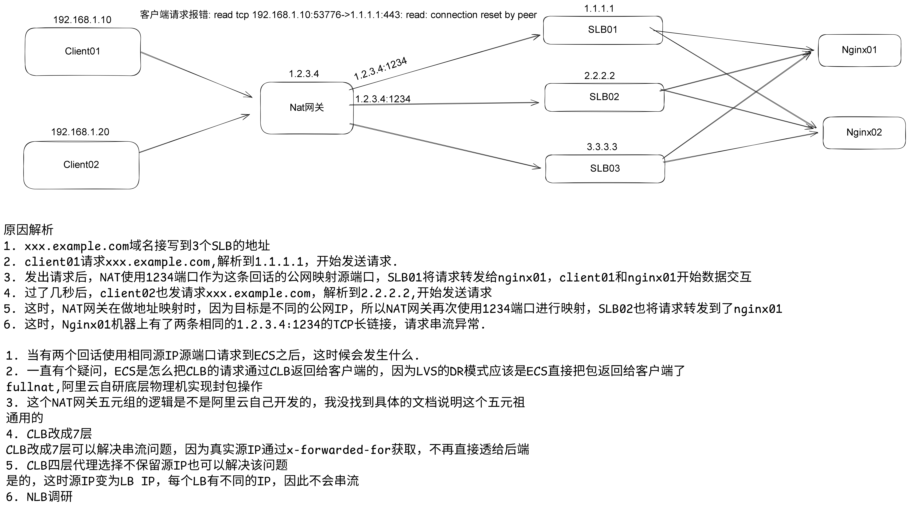

# Nginx 502问题排查

## nginx快速定位异常

|错误信息|错误说明|
| ----- | ---- | 
|"upstream prematurely（过早的） closed connection"	| 请求uri的时候出现的异常，是由于upstream还未返回应答给用户时用户断掉连接造成的，对系统没有影响，可以忽略| 
|"recv() failed (104: Connection reset by peer)"	| （1）服务器的并发连接数超过了其承载量，服务器会将其中一些连接Down掉； （2）客户关掉了浏览器，而服务器还在给客户端发送数据； （3）浏览器端按了Stop| 
|"(111: Connection refused) while connecting to upstream"	| 用户在连接时，若遇到后端upstream挂掉或者不通，会收到该错误| 
|"(111: Connection refused) while reading response header from upstream"	| 用户在连接成功后读取数据时，若遇到后端upstrream挂掉或者不通，会收到该错误| 
|"(111: Connection refused) while sending request to upstream"	| Nginx和upstream连接成功后发送数据时，若遇到后端upstream挂掉或者不通，会收到该错误| 
|"(110: Connection timed out) while connecting to upstream"	| nginx连接后面的upstream时超时| 
|"(110: Connection timed out) while reading upstream"	| nginx读取来自upstream的响应时超时| 
|"(110: Connection timed out) while reading response | header from upstream"	nginx读取来自upstream的响应头时超时| 
|"(110: Connection timed out) while reading upstream"	| nginx读取来自upstream的响应时超时| 
|"(104: Connection reset by peer) while connecting to upstream"	| upstream发送了RST，将连接重置| 
|"upstream sent invalid header while reading response header from upstream"	| upstream发送的响应头无效| 
|"upstream sent no valid HTTP/1.0 header while reading response header from upstream"	| upstream发送的响应头无效| 
|"client intended to send too large body"	| 用于设置允许接受的客户端请求内容的最大值，默认值是1M，client发送的body超过了设置值| 

## Nginx日志没有记录请求，客户端报错EOF 或 Connection reset by peer




## Nginx日志状态码为502

### 负载均衡实例连接数超限(Connection reset by peer)

> 报错: recv() failed (104: Connection reset by peer) while reading response header from upstream

线上Nginx运行了n年后，业务发现有502错误的错误，通过排查发现这个502已经持续了很久很久，通过error日志发现报错是`recv() failed (104: Connection reset by peer) while reading response header from upstream`

#### 业务架构


graph LR;
  A[client]
  B[公网Nginx负载均衡]
  C[Nginx]
  D[内网Istio负载均衡]
  E[Istio Gateway]
  F[k8sService]
  A --> B 
  B --> C 
  C --> D 
  D --> E
  E --> F
  F --> POD1
  F --> POD2


负载均衡: 均使用阿里云的CLB实例

#### 日志排查

排查日志发现, 发现Istio Gateway没有收到Nginx的请求, 所以判断问题出在 **Nginx到Istio Gateway**

#### 抓包

通过抓包发现，TCP连接建立之后，Nginx发送的HTTP请求并没有发送到Istio


#### 解决

通过查看阿里云的SLB监控，发现内网Istio负载均衡有丢包的情况，于是对CLB实例进行了升配，修复了这个问题

### Connection timed out
> upstream timed out (110: Connection timed out) while connecting to upstream
> connect() failed (110: Connection timed out) while connecting to upstream

对CLB实例升配后，虽然502少了特别多，但是还是有502的请求，报错是`upstream timed out (110: Connection timed out) while connecting to upstream`

### 解决方案
增加keepalive, 具体可以参考文档: https://nginx.org/en/docs/http/ngx_http_upstream_module.html#keepalive

**示例**

```
upstream http_backend {
    server 127.0.0.1:8080;

    keepalive 16;
}

server {
    ...

    location /http/ {
        proxy_pass http://http_backend;
        proxy_http_version 1.1;
        proxy_set_header Connection "";
        ...
    }
}
```

# 后续

## 为何SLB并发支持的这么小
> https://www.alibabacloud.com/help/zh/slb/classic-load-balancer/user-guide/faq-about-clb#section-3kw-gvt-8go

* 场景描述：在使用少量长连接的业务场景下，转发分组中的系统服务器可能不会全部被分配到长连接，可能会出现CLB实例达不到QPS峰值的现象。
* 原理（原因）：
因为负载均衡系统通过集群部署的方式为负载均衡实例提供服务，所有外部的访问请求都将平均分散到这些负载均衡系统服务器上进行转发。所以，CLB实例的QPS峰值将被平均设定在多台系统服务器上。

单个系统服务器的QPS上限计算方法为：单个系统服务器QPS峰值=实例总QPS/（N-1）。N为转发分组中系统服务器的个数。例如您在控制台上购买了简约型I（slb.s1.small）规格的CLB实例，对应的QPS为1000，当多客户端同时使用时，总QPS可以达到1000 QPS。若系统服务器个数为8，那么单个系统服务器的最大QPS为1000/(8-1)=142 QPS。

* 推荐方案：
  * 使用单客户端短连接进行压测。
  * 根据实际业务情况减少连接复用。
  * 升配CLB实例规格。具体操作，请参见按量付费（按规格计费）升降配。
  * 使用ALB实例，此种方案下负载均衡实例具有足够的弹性。

## 参考文档
[Nginx: Connection reset by peer 错误定位](https://blog.csdn.net/zzhongcy/article/details/89090193)
[nginx(二十九)error.log记录报错信息分析](https://blog.csdn.net/wzj_110/article/details/124391355)