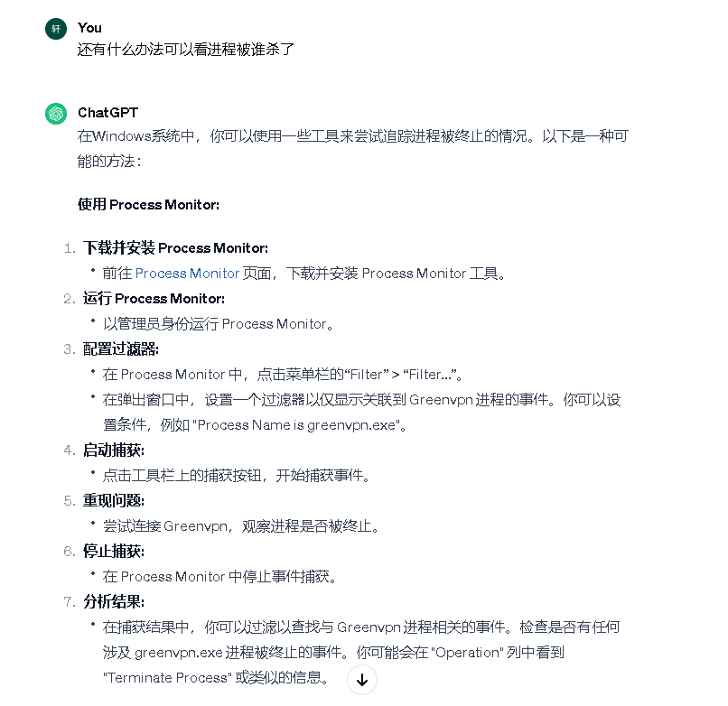
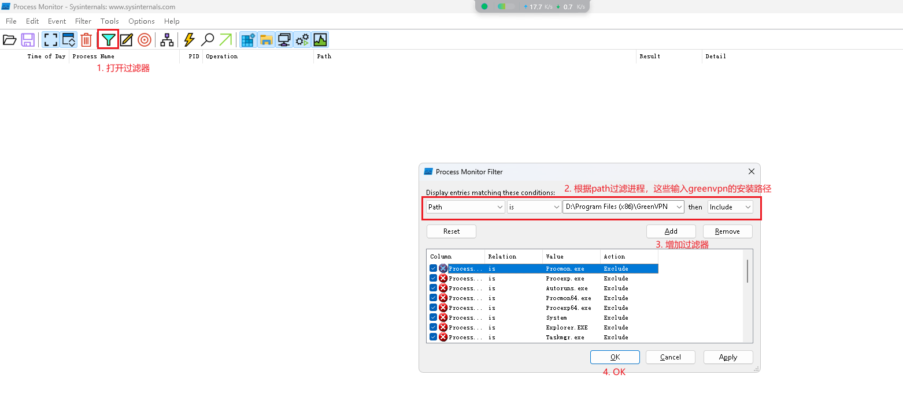
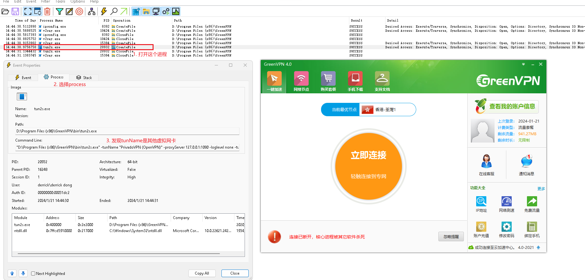
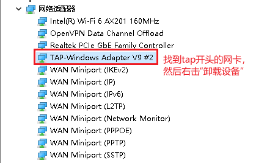

## greenvpn介绍

> 我平常用VPN比较少，所以找了免费的VPN使用，greenvpn的详细使用可以参考: [greenvpn注册](../greenvpn-register#greenvpn-register)

## 连接报错: 链接已断开，核心进程被其他软件杀死

> 结论: 在使用greenvpn之前，使用了其他VPN或在默写情况下启用了加速器，需要先将其他虚拟网卡卸载，然后再尝试连接会让安装win10-tap-9.24.2，安装后然后即可正常连接

### 解决问题的步骤

#### 前期尝试步骤

① 关闭安全软件，禁用相关安全软件开机启动
② 关闭防火墙
③ 重装greenvpn
……

#### 解决步骤

① 经过和ChatGPT的多次沟通，chatgpt给我提供了一个抓取进程事件的软件， Process Monitor
<!--  -->



② 通过微软官方下载process monitor： https://learn.microsoft.com/zh-cn/sysinternals/downloads/procmon

③ 新增过滤器，过滤 greenvpn相关的进程
<!--  -->



④ 再次尝试连接，失败后查看process monitor抓到的进程
<!--  -->



④ 通过设备管理器将虚拟网卡卸载
同时按下键盘上的 `Windows` 和 `R` 键, 在运行对话框中输入 `devmgmt.msc` 并按下 `Enter` 键 打开设备管理器，然后打开网络适配器
<!--  -->



⑤ 再次连接的时候，会提示没有虚拟网卡，然后点击重新加载，然后进行win10-tap-9.24.2的安装, 安装完成后即可正常连接vpn
<!--  -->


